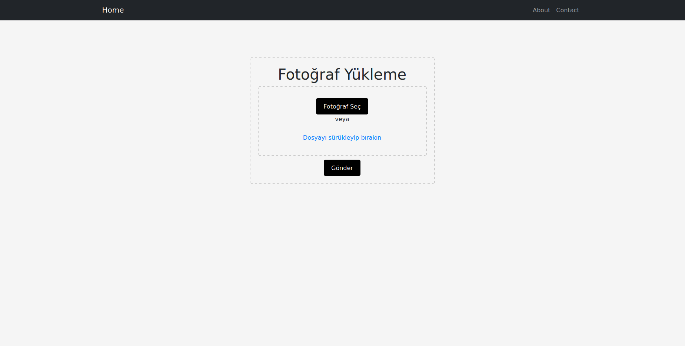

# Zature Hastalığı Teşhisi Uygulaması

Zature hastalığının teşhisi için kullanılan bir React.js uygulamasıdır. Bu uygulama, kullanıcının bir fotoğraf yüklemesine izin verir ve ardından bu fotoğraf üzerinde teşhis sonuçlarını gösterir.

## Kullanım

1. **Fotoğraf Yükleme:**
   - Uygulama içindeki dosya yükleme butonunu kullanarak veya sürükle-bırak yöntemi ile bir fotoğraf yükleyin.

2. **Teşhis Sonuçları:**
   - Fotoğraf yüklendikten sonra, uygulama otomatik olarak Zature hastalığı teşhisi koyar ve sonuçları ekranda görüntüler.

## UYGULAMA GÖRÜNTÜSÜ



## Kurulum

Proje dosyalarını bilgisayarınıza klonlayın ve aşağıdaki adımları takip edin:

```bash
git clone https://github.com/osmantemel/Pnemonia-frontend.git
cd  Pnemonia-frontend
npm install
npm start
