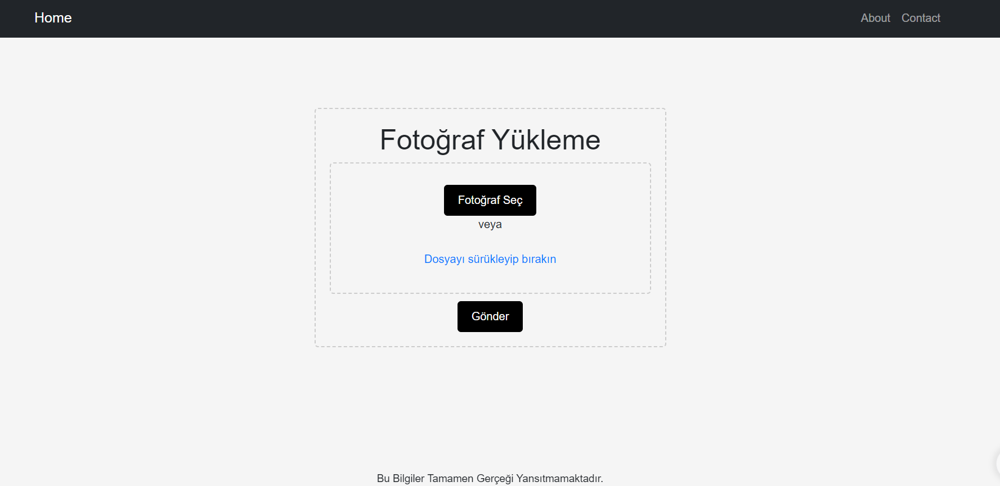
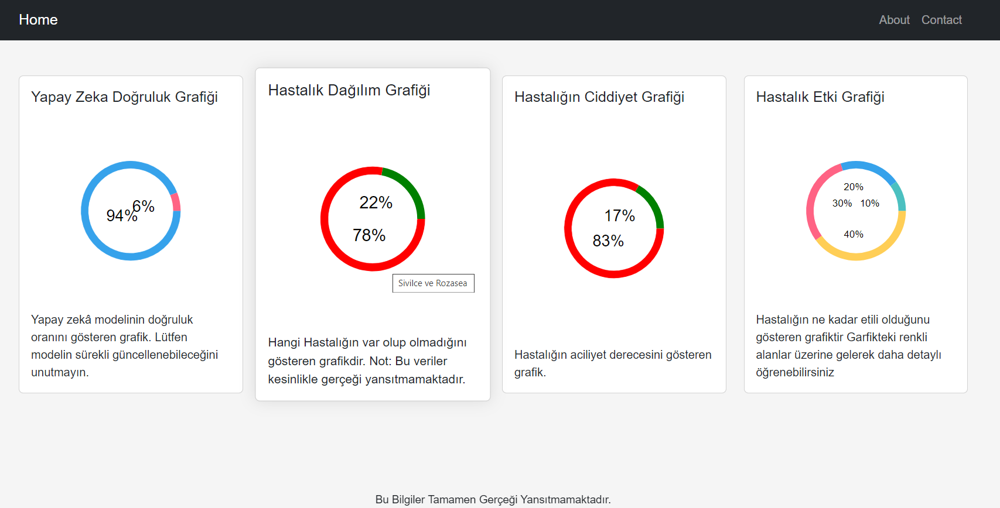
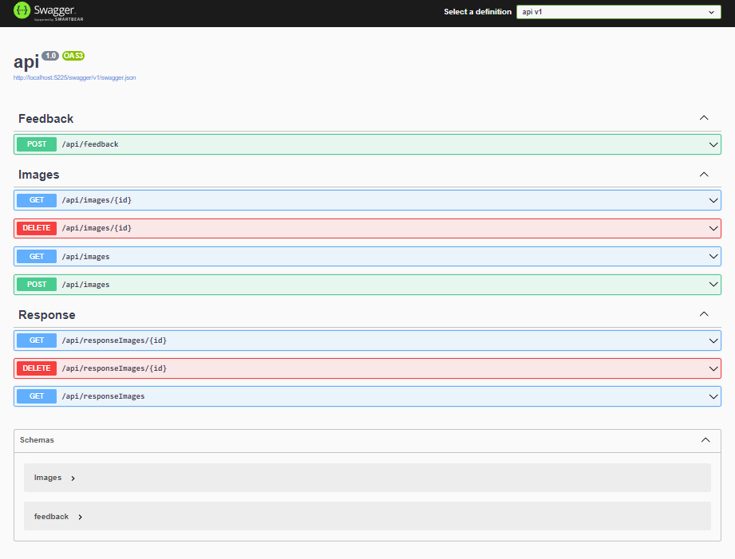
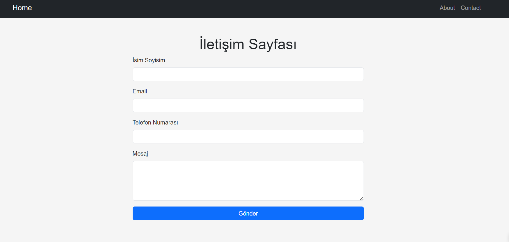
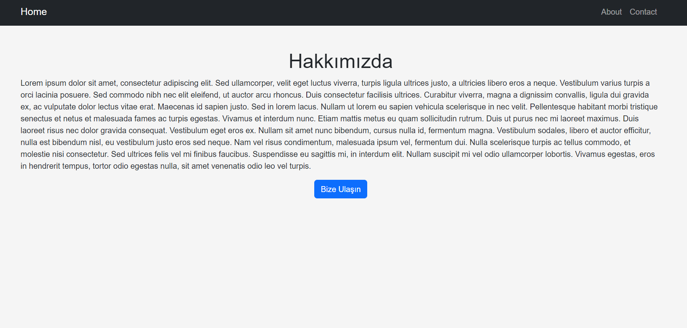

# Proje Adı

## Açıklama

Projenin amacı, kullanıcıların yapay zekâ modeli aracılığıyla Cilt hastalık tespiti sonuçlarını görsel olarak analiz etmelerini sağlamaktır ve kullanıcılara yapay zeka ile sonuc sunmaktır

## Projeyi Çalıştırma

Projeyi yerel makinenizde çalıştırmak için aşağıdaki adımları izleyin:

1. Depoyu klonlayın:

```bash
git clone https://github.com/osmantemel/Skin-Diseases-Diagnosis-Application.git
```

2. Proje dizinine gidin:

```bash
cd proje
```

3. Gerekli paketleri yükleyin:

```bash
npm install
```

4. Projeyi başlatın:

```bash
npm start
dotnet run
python dataConn.py
```

## Kullanılan Teknolojiler

- React.js
- JavaScript
- Python
- ASP.NET WEB API
- HTML
- CSS


## Ekran Görüntüleri








